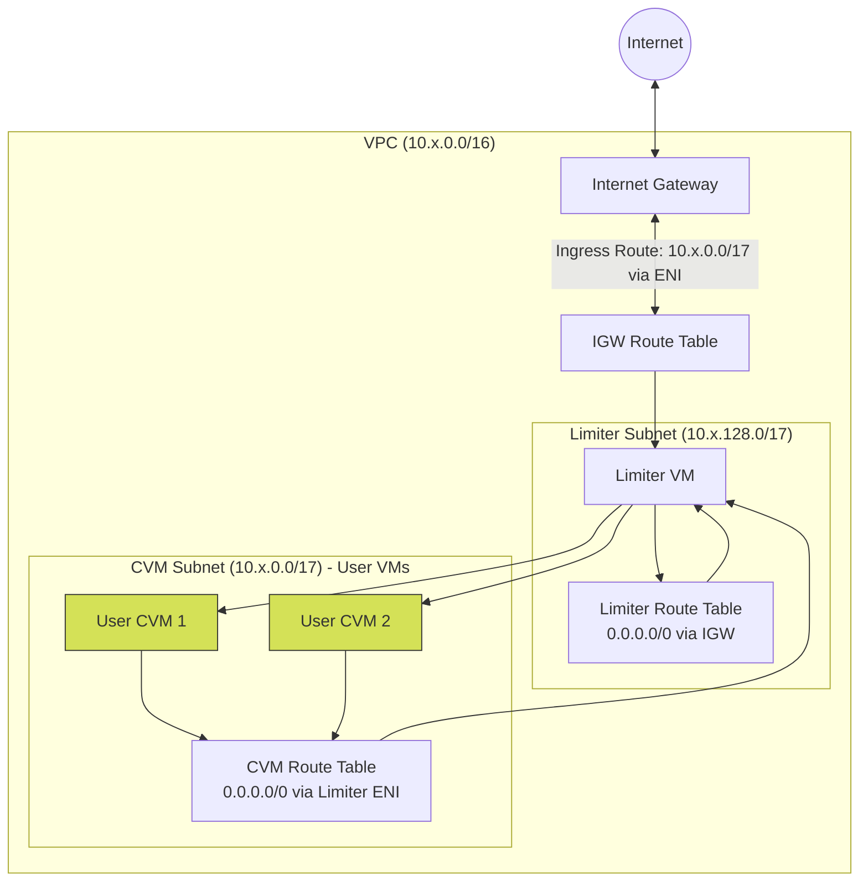

# Marlin CVM Account Setup

This document outlines the account setup implemented as a Pulumi project for the Marlin CVM platform.

## Overview

The Pulumi project creates a secure, controlled network environment where user CVMs are deployed in an isolated subnet, and all ingress and egress traffic is routed through a central "Limiter" VM.

The primary reason for this architecture is **traffic control and rate limiting**. By forcing all traffic to and from the CVMs through a single proxy instance (the Limiter), the system can effectively:
- Monitor bandwidth consumption per CVM.
- Enforce strict rate limits on outgoing and incoming traffic to prevent abuse.

## Network Topology

## Component Details

### 1. Virtual Private Cloud (VPC)
Each region gets a dedicated VPC (`10.{ridx}.0.0/16`) with DNS support enabled. This isolates the Marlin CVM environments regionally.

### 2. Subnets
The VPC is split into two subnets:
* **CVM Subnet (`10.{ridx}.0.0/17`)**: The private subnet where user VMs are deployed. It does *not* map public IPs on launch. Instead, Elastic IPs are assigned to the instance after launch by the control plane.
* **Limiter Subnet (`10.{ridx}.128.0/17`)**: The public-facing subnet hosting the Limiter VM.

### 3. The Limiter VM
The Limiter VM is deployed using a custom AMI (`marlin/limiter-amd64-*`). **Note:** This AMI is built directly from the `limiter.nix` file derivation, which ensures a reproducible and deterministic build for the rate limiting and proxy environment.
* It is assigned a Public IP.
* **Source/Destination Check is disabled**: This is a critical AWS EC2 setting that allows the instance to process traffic not specifically destined for its own IP address, enabling it to act as a router/NAT instance for the CVM subnet.

### 4. Routing Configuration (The Chokepoint)
The architecture uses customized route tables to strictly control traffic flow:
* **Limiter Route Table (`rt-rl`)**: The Limiter subnet has a default route (`0.0.0.0/0`) pointing directly to the Internet Gateway, allowing it to reach the outside world.
* **CVM Route Table (`rt-cvm`)**: The CVM subnet's default route (`0.0.0.0/0`) points to the **Elastic Network Interface (ENI) of the Limiter VM**. This forces all outbound traffic from user VMs to pass through the Limiter.
* **IGW Route Table (`rt-igw`)**: The Internet Gateway itself has an edge association. Any traffic entering from the internet destined for the CVM Subnet CIDR (`10.{ridx}.0.0/17`) is routed to the Limiter VM's ENI. This ensures the Limiter intercepts all inbound traffic targeting CVMs.

**Notable Omissions (Intentional Absences):**
* **No Direct Route from CVM Subnet to IGW**: A typical public subnet has a route to the IGW (`0.0.0.0/0 -> igw-id`). This is intentionally omitted in the CVM Route Table to completely isolate CVMs from direct internet access, preventing bypass of the Limiter's rate limits and security policies.
* **No Direct Route from IGW to CVM Instances**: While the VPC implies local routing, the edge association on the IGW explicitly hijacks traffic meant for the CVM subnet and forces it to the Limiter ENI.

### Security Groups
Both subnets are provisioned with security groups allowing open traffic (`0.0.0.0/0` in/out on all ports). While this looks permissive at the AWS network level, actual security and access control are intended to be strictly enforced by the Limiter VM's internal firewall and proxy services, maintaining the Limiter as the single source of truth for network policy.

## Resource Isolation and Tagging

The infrastructure code applies specific tags to all deployed resources (e.g., `manager: "pulumi"`, `project: "marlin-cvm"`, and `type`). These tags properly separate the Marlin CVM infrastructure from any other existing resources within the AWS account. 

**Operator Notice:** 
When operating this infrastructure, care must be taken to ensure that network configuration (like the `10.x.0.0/16` VPC CIDR blocks) and security group rules do not conflict with existing infrastructure. Operators should use the applied tags to explicitly filter and manage Marlin CVM resources, avoiding accidental modifications or deletions of other workloads residing in the same account.
